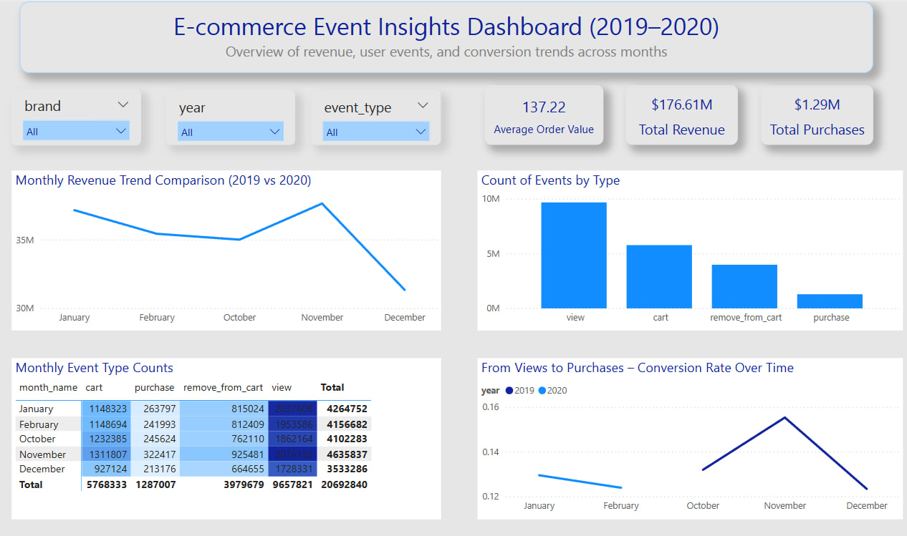

# E-commerce Event Insights Dashboard (2019–2020)

This dashboard visualizes user event data from an e-commerce platform to explore patterns in user behavior, purchasing trends, and overall engagement from October 2019 to February 2020.

## 📊 Overview

The report includes:

- Total revenue, purchases, and average order value
- Monthly trends for revenue and conversion rate
- User behavior breakdown (view, cart, remove from cart, purchase)
- A matrix with conditional formatting to show event counts across months

## 📁 Data Source

The raw dataset was downloaded from **Kaggle**, containing monthly CSV files:

- 2019-Oct.csv
- 2019-Nov.csv
- 2019-Dec.csv
- 2020-Jan.csv
- 2020-Feb.csv

You can access the dataset for this project here:  
[Kaggle Dataset - Ecommerce Events History in Cosmetics Shop](https://www.kaggle.com/datasets/mkechinov/ecommerce-events-history-in-cosmetics-shop)

## 🏗️ Data Modeling

The data was cleaned, transformed, and modeled in Microsoft Fabric. Custom **Fact and Dimension tables** were created manually, including:

- `Fact_UserEvents`
- `Dim_Date`
- `Dim_Product`
- `Dim_User`

A star schema was built with proper relationships between the tables.

## 📈 Report Highlights

- Interactive slicers for year, brand, and event type
- Custom tooltips for better context
- KPI cards and trend charts
- Conditional formatting in matrix view

## 🛠️ Tools Used

- Microsoft Fabric (Lakehouse, Dataflows, Notebooks)
- Power BI (Direct Lake Mode)
- DAX

## 📸 Screenshots

## 🧠 Code Files

- `code.py`: Includes Python code for processing, cleaning, and transforming the raw CSV files before creating the semantic model in Microsoft Fabric.

### 🔍 Insights Gained

- 📈 November had the highest user engagement, with peaks in views and purchases.
- 💡 The conversion rate was highest in November, possibly due to holiday promotions or user intent.
- 🛒 Many users added items to the cart but didn’t complete the purchase, indicating potential drop-off points.
- 👀 Views consistently outnumbered other event types, showing strong interest but lower commitment.
- 📉 A noticeable decline in purchases and conversion rate in December suggests reduced post-holiday activity.

---

> # Created by Sahar Radmehr.
